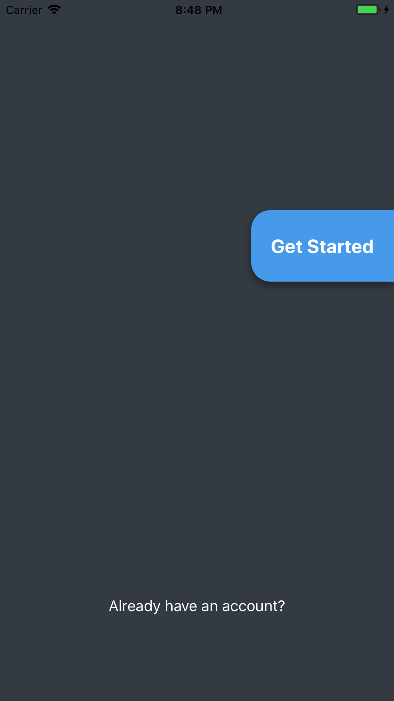
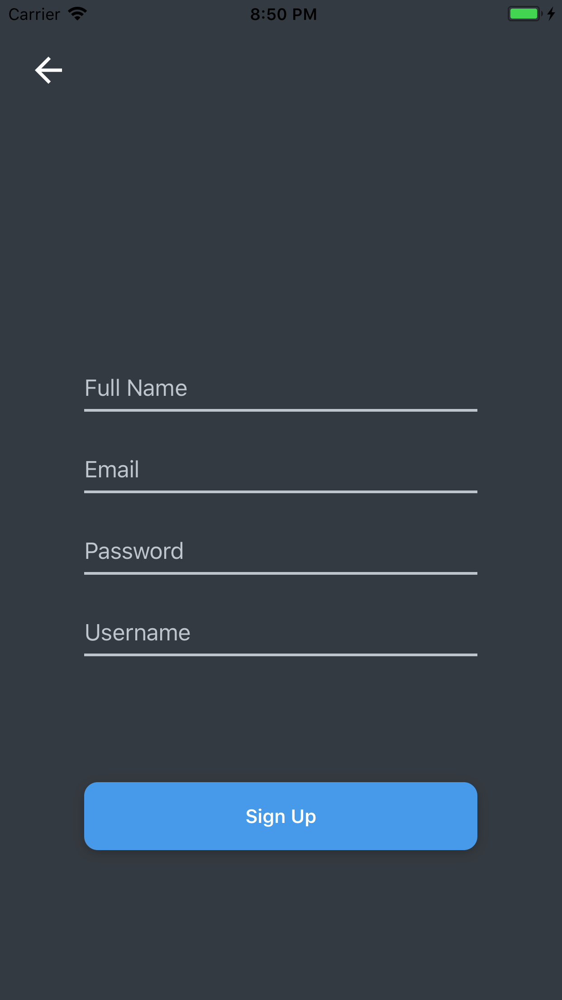

# Twitter-Clone

This is a clone of Twitter is created using React-Native, MongoDB, and GraphQL

## Current prgoress.

### 25 of November. Navigation branch

  - finished linking the back-end to the front-end

  - added Sign in page when user is not signed in